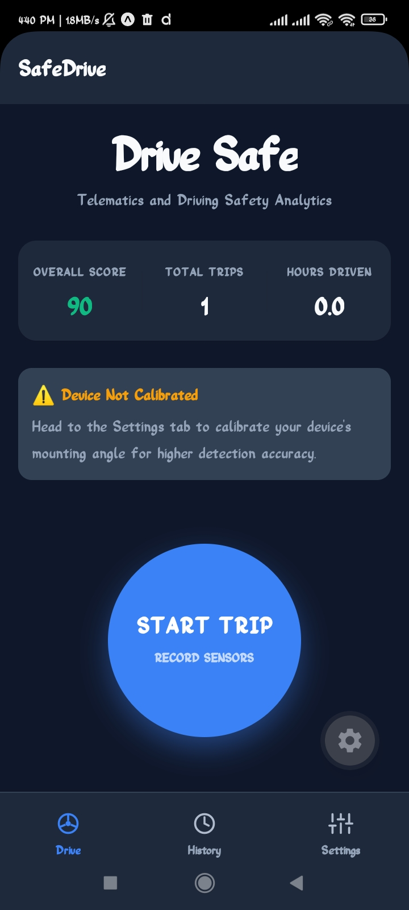
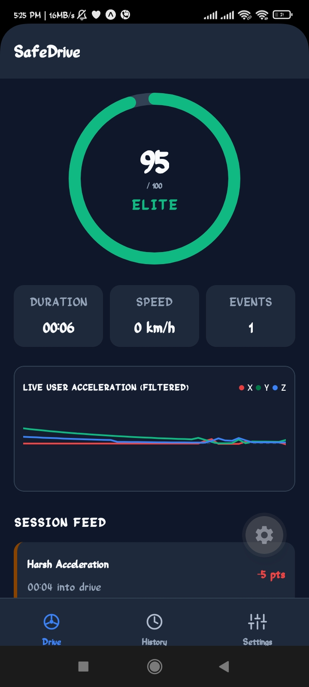
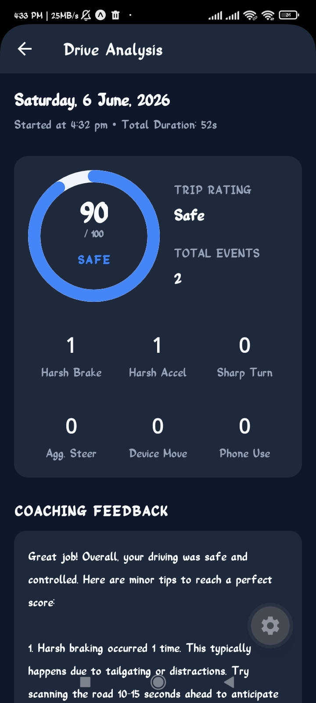
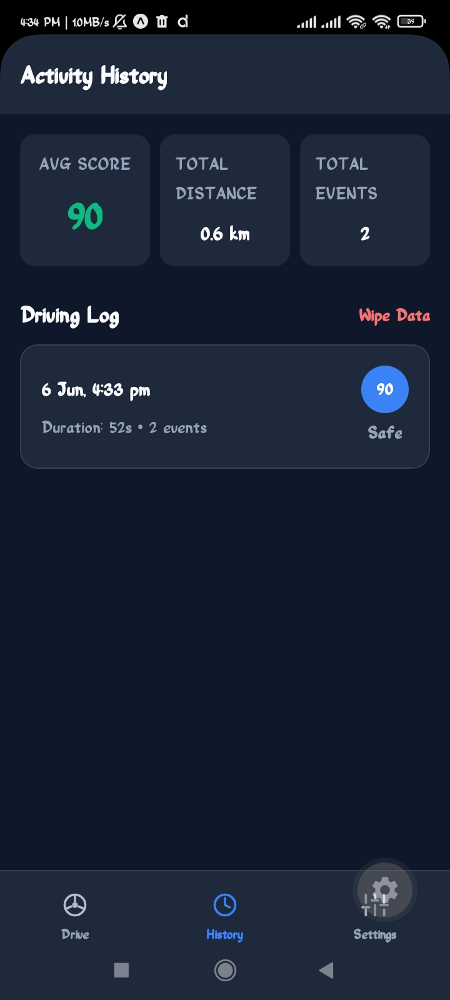
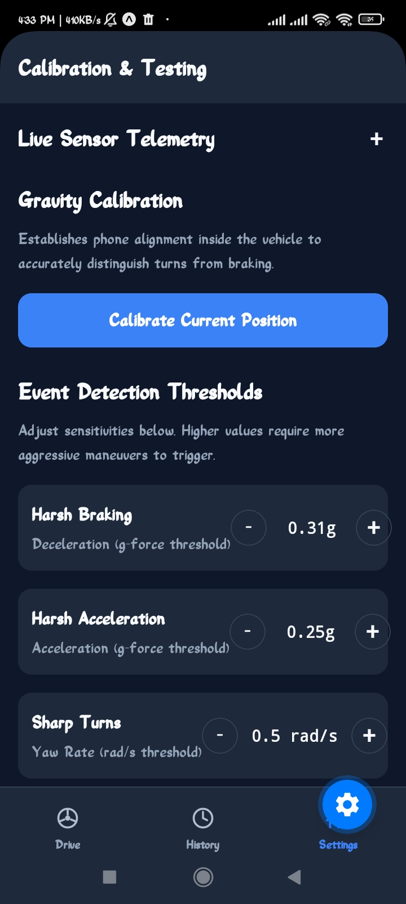

# SafeDrive 🚗

A React Native mobile application that uses device sensors to analyze driving behavior and generate a real-time Driving Safety Score.

---

## 📋 Project Overview

SafeDrive monitors your driving in real-time using the phone's built-in sensors. It detects unsafe driving events like harsh braking, rapid acceleration, sharp turns, and phone distraction, then deducts points from a starting score of 100 to calculate a final safety rating at the end of each trip.

The app includes:

- **Start / End Drive** session management
- **Real-time event detection** with haptic alerts
- **Live telemetry display** (accelerometer oscilloscope)
- **Driving score gauge** that updates in real-time
- **Trip summary** with event breakdown, timeline, and AI coaching feedback
- **Route replay map** with color-coded event pins
- **History tab** with score trend chart across past trips
- **Drive simulator** for testing without a real car

---

## � Demo Video

Watch SafeDrive in action: [View Demo Video](https://drive.google.com/file/d/1P-wEcSQCfvoewUYai_e4fcCAzyJC9Z8W/view?usp=sharing)

---

## �🛠️ Tech Stack

| Library                     | Purpose                                              |
| --------------------------- | ---------------------------------------------------- |
| React Native + Expo SDK 55  | Core framework                                       |
| Expo Router                 | File-based navigation                                |
| expo-sensors                | Accelerometer, Gyroscope, DeviceMotion, Magnetometer |
| expo-location               | GPS speed and route tracking                         |
| expo-haptics                | Vibration feedback on event detection                |
| react-native-svg            | Score gauge, telemetry chart, route replay map       |
| @react-native-async-storage | Saving and loading drive history                     |
| react-native-reanimated     | Smooth UI animations                                 |

---

## 📡 Sensors Used

| Sensor            | What It Measures                                                | Used For                                  |
| ----------------- | --------------------------------------------------------------- | ----------------------------------------- |
| **Accelerometer** | Raw device acceleration (X, Y, Z) in g-force                    | Detecting braking and acceleration forces |
| **Gyroscope**     | Angular velocity (rotation rate) in rad/s                       | Detecting sharp turns and swerving        |
| **Device Motion** | OS-fused sensor data — separates gravity from user acceleration | More accurate force separation            |
| **Magnetometer**  | Magnetic field strength (microteslas)                           | Compass heading data (supplementary)      |

All sensors run at **10Hz (100ms intervals)** to balance accuracy and battery usage.

---

## 🔍 Event Detection Strategy

The app listens to sensor data 10 times per second. For each reading, it runs the following checks:

**1. Harsh Braking**
Detected when horizontal acceleration exceeds the braking threshold while the phone is not rotating (to filter out turns). The Y-axis deceleration must be negative, indicating the car is slowing down.

**2. Harsh Acceleration**
Same as braking but in the opposite direction — positive Y-axis acceleration while horizontal force exceeds the acceleration threshold.

**3. Sharp Turn**
Detected by measuring the yaw rate (rotation around the vertical/gravity axis). If the phone rotates faster than the turn threshold, a sharp turn is flagged.

**4. Aggressive Steering / Swerving**
Detected by measuring how quickly the yaw rate changes between readings. A sudden spike in rotation rate indicates an abrupt lane change or swerve.

**5. Excessive Device Movement**
Measured by calculating the variation (standard deviation) of gyroscope readings over the last 1 second. High variation while also having high accelerometer variation means the phone is loose, sliding, or vibrating.

**6. Phone Handling / Distraction**
After the user calibrates the phone's resting position, the app tracks if the gravity direction changes by more than 15 degrees combined with hand-tremor-level rotation. This indicates the phone was picked up or manipulated while driving.

**Debouncing:** All events have a 2.5-second cooldown to prevent the same event from being counted multiple times in a row.

---

## 📊 Threshold Values

| Event                     | Threshold                            | Unit               |
| ------------------------- | ------------------------------------ | ------------------ |
| Harsh Braking             | > 3.0                                | m/s²               |
| Harsh Acceleration        | > 2.5                                | m/s²               |
| Sharp Turn                | > 0.5                                | rad/s              |
| Aggressive Steering       | > 1.2                                | rad/s²             |
| Excessive Device Movement | σ > 0.8 (gyro) + σ > 2.0 (accel)     | standard deviation |
| Phone Handling            | > 15 degrees tilt + gyro > 0.4 rad/s | degrees            |
| Debounce Window           | 2.5                                  | seconds            |

Thresholds can be adjusted from the **Settings tab** inside the app.

---

## 🧮 Driving Score Calculation

Every driving session starts with a perfect score of **100**.

Points are deducted in real-time as unsafe events are detected:

| Event                     | Points Deducted |
| ------------------------- | --------------- |
| Harsh Braking             | -5              |
| Harsh Acceleration        | -5              |
| Sharp Turn                | -3              |
| Aggressive Steering       | -3              |
| Excessive Device Movement | -2              |
| Phone Handling            | -10             |

The score never drops below **0**.

At the end of the drive, a **Safety Rating** is assigned based on the final score:

| Score    | Rating         |
| -------- | -------------- |
| 95 – 100 | Elite Driver   |
| 85 – 94  | Safe Driver    |
| 70 – 84  | Average Driver |
| Below 70 | Risky Driver   |

---

## 💻 How to Run Locally

### Prerequisites

- [Node.js](https://nodejs.org/) installed
- [Expo Go](https://expo.dev/client) app installed on your phone

### Steps

1. Clone the repository:

   ```bash
   git clone <repository-url>
   cd proj-safe-drive-chaicode
   ```

2. Install dependencies:

   ```bash
   npm install
   ```

3. Start the development server:

   ```bash
   npm run start
   ```

4. Scan the QR code with **Expo Go** on your Android or iOS device.

### Platform Commands

```bash
npm run android   # Open on Android emulator
npm run ios       # Open on iOS simulator (macOS only)
npm run web       # Open in browser
```

---

## 📝 Assumptions Made

1. **Phone Mounting Position:** The app assumes the phone is placed in a dashboard or windshield mount while driving. For best accuracy, use the **Calibrate** button in Settings after placing the phone in its mount.

2. **GPS Availability:** GPS is used for speed display and route mapping. If GPS is unavailable, the app still detects all driving events using sensor data alone.

3. **Sensor Update Rate:** 100ms (10Hz) was chosen as the update interval. This is fast enough for accurate event detection while keeping battery usage low.

4. **Simulator for Testing:** A built-in drive simulator (in Settings) lets you test all features without driving. Choose from Safe Commute, Sport Mode, or Distracted Driver profiles.

---

## 📸 Screenshots

### Home Dashboard

Shows overall score, total trips, hours driven, and the START TRIP button.



### Active Driving HUD

Real-time circular score gauge, duration, speed, live accelerometer chart, and detected event feed.



### Trip Summary

Final score, safety rating, full event breakdown (all 6 categories), AI coaching feedback, interactive route replay map with event pins, and a full event timeline with timestamps.



### History Tab

Score trend chart across recent trips, aggregate stats, and a list of all past drives.



### Settings / Calibration Tab

Live sensor readings, gravity calibration, threshold adjusters, and driving simulator launcher.


